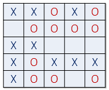
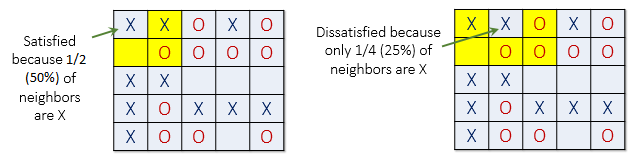
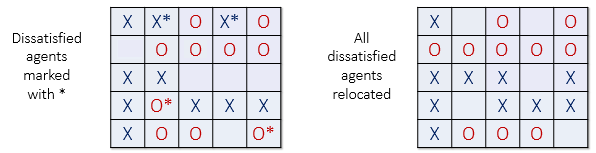

# CS50 Final Project: Schelling's Model of Segregation
# Programmer: Alwin Tareen

# Introduction
Segregation has always been a social problem in the United States. Why is segregation such a difficult problem to eradicate? In 1971, the American economist Thomas Schelling created an agent-based model that might help explain why segregation is so difficult to combat. His *model of segregation* showed that even when individuals(or *agents*) didn't mind being surrounded or living by agents of a different race, they would still *choose* to segregate themselves from other agents over time! Although the model is quite simple, it gives a fascinating look at how individuals might self-segregate, even when they have no explicit desire to do so.

# How the Model Works
Schelling's model will now be explained with some minor changes. Suppose there are two types of agents: X and O. The two types of agents might represent different races, ethnicity, economic status, etc. Two populations of the two agent types are initially placed into random locations of a neighborhood represented by a grid. After placing all the agents in the grid, each cell is either occupied by an agent or is empty as shown.

Now we must determine if each agent is **satisfied** with its current location. A **satisfied** agent is one that is surrounded by at least `t` percent of agents that are like itself. This threshold `t` is one that will apply to all agents in the model, even though in reality everyone might have a different threshold they are satisfied with. Note that the higher the threshold, the higher the likelihood the agents will not be satisfied with their current location.

For example, if `t` = 30%, agent X is satisfied if at least 30% of its neighbors are also X. If fewer than 30% are X, then the agent is not satisfied, and it will want to change its location in the grid. For the remainder of this explanation, let's assume a threshold `t` of 30%. This means every agent is *fine with being in the minority* as long as there are at least 30% of similar agents in adjacent cells.

The picture below(left) shows a satisfied agent because 50% of X's neighbors are also X(50% > `t`). The next X(right) is not satisfied because only 25% of its neighbors are X(25% < `t`). Notice that in this example, empty cells are not counted when calculating similarity.

When an agent is not satisfied, it can be moved to any vacant location in the grid. Any algorithm can be used to choose this new location. For example, a randomly selected cell may be chosen, or the agent could move to the nearest available location.

In the image below(left), all dissatisfied agents have an asterisk next to them. The image on the right shows the new configuration after all the dissatisfied agents have been moved to unoccupied cells at random. Note that the new configuration may cause some agents which were previously satisfied to become dissatisfied! 

All dissatisfied agents must be moved in the same *round*. After the round is complete, a new round begins, and dissatisfied agents are once again moved to new locations in the grid. These rounds continue until all agents in the neighborhood are satisfied with their location.
