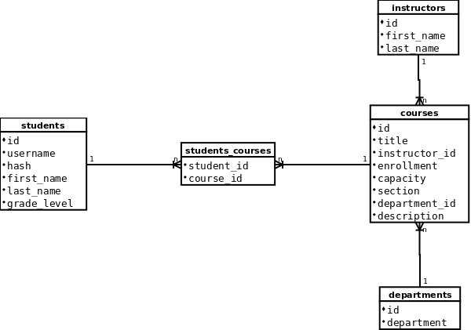

# CS50 Final Project: A Course Registration System in Flask
## Programmer: Alwin Tareen
## Video Demo: https://www.youtube.com/watch?v=Yaxqnq3_OKg

# Introduction
High schools and universities are commonly faced with the arduous task of getting their students signed up for their offered courses. This administrative undertaking is usually achieved by having the students fill out paper forms, which are then submitted to staff members, who are then tasked with entering this data into computer systems. This tends be a laborious, time-consuming chore, which is prone to errors and omissions, making the entire process awkward and unreliable. My final project implements a simplified course registration system, in which students can securely log on to a website, and select their desired courses in a comprehensive, organized manner. Once all of the students have made their selections, the administrative staff can simply query the database to retrieve their course selection data.

# The Implementation Stack
I decided to use a PostgreSQL database to store the student and course information. On the front end, I chose the Flask web framework to render the course registration website, because I happen to be quite well versed in Python. Then, I deployed the entire project on the Heroku Web Service, because they have an excellent free hobby tier which is well suited for small web projects such as this.

# The Backend Database
I wanted to make sure that the database schema was as comprehensive and detailed as possible, so that I minimize any design revisions that might emerge later in the project. I knew that I would have both students and courses to deal with, but what was the relationship between them, and were there any other entities that might come into play? I soon realized that each course had to have an instructor, and also, each course belonged to a department, such as mathematics, science, humanities, etc. Therefore, I decided to create four tables: students, courses, instructors, and departments. However, there was something unusual about the relationship between the students and courses, because I realized that a student could register for many courses, and that a course can have many students. In other words, there was a many-to-many relationship between students and courses. This meant that I had to create a join table between them, which I called students_courses. The database ended up having 5 tables in total.

# The Frontend Flask Website
Once the database was complete, I turned my attention to creating the web frontend for the course registration system. Once students are logged in to the website, they are greeted with two tables: a table which outlines the courses they are currently registered for, and another table which details all of the courses which are on offer. Each course is associated with a section number, from 1 to 6, and students are expected to fill each of their 6 section slots with whichever course they desire. In order to register for a course, a student has to click on the "Register" tab, which brings them to a drop-down list from which they select one of the 6 sections. From there, they can select one of the courses from that section. This brings up a table outlining the details and description of the course. If the student likes the course, they simply press the "Register" button, which brings them back to their schedule page, and the newly registered course should be present there. I also implemented a way for students to deregister from a course. They just have to click on the "Drop" tab, then select one of their registered courses from a drop-down list. This takes them to a page in which they have to confirm their decision. Once they press the "Confirm" button, they are taken back to their schedule page, where they can see their update course listings.

# Future Work
In its current form, the course registration website is pretty basic, so I would like to add more features in the future. For instance, at the course listing page, I would like to have each course title set up as a link, so if a student were to click on it, they could view all of the students registered for that course, as well as other descriptive information.
